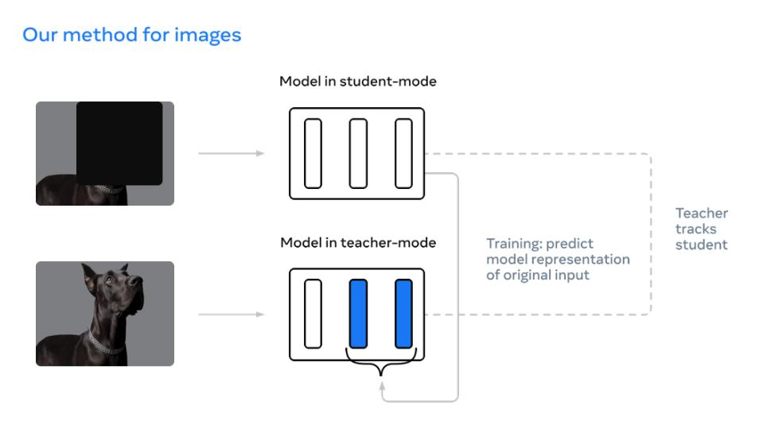

> Explore wider usage of CLIP, a large scale self-supervised models. We believe CLIP have more usage than what's shown in the original paper, as it has great feature extraction ability.

<!--more-->
{: class="table-of-content"}
* TOC
{:toc}

#  Motivition 
<!-- 
Imagine you are a machine learning engineer. One day, you want to add some new features for a classification task. For example you may need to do some fine grained classification on chopsticks like identify whether it is a Sushi chopstick, disposable chopstick or hot pot chopstick, but you do have any data. Then, one simple way to solve this problem is to do some data collection on your own, because your boss think find some new people to label it is too complex and time consuming. So, you followed the advice of your boss and then collect some chopstick data and train it. But things can happen over and over again, maybe today is chopsticks, tomorrow is soups and then your inference pipeline become more and more difficult to maintain. 

But could we just maintain some easily accessible data like image with language supervision and then train a model like clip instead of maintain lots of specialized model and data? For example, CLIP representation is very powerful and able to outperform many existing model with only CLIP image feature and linear classifier. Could we just maintain CLIP model and its training data and do simple ML classification instead of train deep model each time? 

#  What we hope to demonstrate -->
Recently, there is a trend in industry to train large-scale self-supervised models. Such models utilize huge amount of unlabeled data to learn the intrinsic features, and in this way to get more general and robust prediction result. CLIP is such a model consisting of an image encoder and a text encoder. In the forward stage, it calculates the loss based on the difference between the image/text feature vector pair with an image/text-description pair as input, and optimizes the two encoders' parameters simultaneously. Typical usage of the CLIP model includes using the image encoder as pretrained model to finetune, and formulizing the prediction task as text queries, together with the image feeding into CLIP to get a score vector. However, in CILP paper, OpenAI mainly focus on its zero-shot learning performance and the cost for getting a CILP model still remain expensive. In recent years, new methods was proposed and shown to be powerful on downstream tasks. We believe CLIP and other recent model have more usage than what's shown in the original paper, as it has great feature extraction ability but when and how to use remain to be explored.

First we'll compare different models trained with different amount data for each label in dataset that is different from ImageNet. We want to see if finetuning CLIP as pretrained model results in higher accuracy, fewer labeled data for a specific task.

Second, we'll use different vision models to extract feature vectors for a specific task/dataset, and unsupervised-learn to cluster the vectors. We'll examinate whether the cluster reflects the actual data label. 

Third, we'll also further explore the generality of CLIP. Whether its good features is sensitive to the specific data domain (whether similar data exists in original unlabeled training data or not)

# Related work 

## Tested model: 

The experiment is run on the following model, there are 3 type of model

Type 1: language supervised model
- CLIP model( VIT-32 ) [1]  
  
We have introduced [CLIP](#goal) model in the motivation section.

Type 2: model trained on open scource dataset (ImageNet)
- Vision Transformer: VIT-32 (base and large version), VIT-16 (base and large version) [2]  
  
Vision Transformer is the first attemption to use transformer architecture on CV tasks and achieves SoTA performance. It divides the image horizontally and vertically into several patchies (for example, dividing a 224\*224 image into \#(14\*14) pacthes of size 16\*16) and then linear transforms every patch and adds them with respective positional embeddings. (Here a special token embedding position 0 and having special meaning 'cls' is used to capture the overall relation of patches) The resulting 196 vectors are quantitively small enough to be used as input tokens to feed the standard transformer encoder architecture. After several encoder layers, the output at position 0, which captures the overall relation, is connected with header network to generate the result.  
Experiments show that with the help of masive number of supervised training data, ViT can beat state-of-the-art convolution-based models, and its performance scales well with the number of parameters and the amount of training data.  
For ViT-16 and ViT-32, the number difference indicates the number of dividents on each dimension. E.g. for ViT-16, images are divided into \#16\*16 pacthes.

- New CNN: convnext_small, convnext_base [3]  
  
Since the invention of vision transformer, researchers find many ways to replace the core attention mechanism with simplier modules while still attaining comparable performance, and thus it's doubtable whether the success of ViT contributes to the attention mechanism or other delicate designs of the transformer architecture. In ConvNext, researchers modify ResNet architecture to adopt several modern designs in ViT. It uses a different stage compute ratio and different stem cell structure, and use grouped convolution to reduce the computation amount. ConvNext also follows ViT to use a inverted bottleneck layer, and larger kernel size.  
Besides these macro changes, ConvNext also has some micro changes like replacing ReLU activation with GeLU activation and reducing the activation layer number. Overall, ConvNext uses pure convolutional architecture to reach the top performance once again.

- Traditional CNN: efficientnet_b4,efficientnet_b6 [4]  
  
EfficientNet is a class of convolutional networks found by NAS (neural architecture search). Researchers use MBConv as basic block and search the same exploration space as MnasNet to get most basic EfficientNet-B0. Then they do grid search on the space consisting of three scaling factors: network depth (number of layers), width (number of kernels per layer) and resolution (size of image/feature map). Finally for different accuracy/efficiency requirement, they multiply these factors with a single compound value to get the network configuration.

Type 3: Model with self-supervised pretraining

- Beit [5]  
  
Beit is a self-supervised pretrained ViT model. It has two parts.  
The first part is a dVAE (Discrete Variational Autoencoder). The dVAE is trained to compress the original image into a series of token (integer value) with each token representing a patch in the original image. Then tokens are mapped to a dictionary storing their latent vectors, and further used to restore the original image. After dVAE training, the dVAE part generating tokens produce good representations of image patches.  
The second part is a ViT. In every training step, the original image is masked for several patches and then fed into the vision transformer to generate a series of value for the patches. At the same time, the original image without any mask is fed into dVAE to get the token repsentation per patch. The dVAE generated tokens are used as labels to train the vision transformer to learn the masked patch tokens. In this process, it learns the representation of images.

- MAE [6]  
  
MAE (masked autoencoders) is another self-supervised learning approach for vision transformers. It masks patches of the original image and use the simply linear transformed representation of unmasked patches as well as their positional embeddings as input tokens to feed into the vision transformer, and feed the output into another network to rebuild the original image. It differs from the most primitive self-supervised learning method proposed in ViT paper in two ways. First, the authors observe that image data has much more redundant information than the word sequence, and thus a low proportion of patch masking is not sufficient to learn. For example, an image masked one patch for every two patches can be easily restored by linear interpolation with little loss of semantic information. Consequently, in MAE most patches are masked and only unmasked patches participant into the computation. Second, images contain many details and a MLP network (original head network of ViT) is not sufficient to regenerate it well, and thus MAE use another transformer instead.

- DINO [7]  
  
DINO uses a process called self-distillation to learn. It consists of two transformer networks of the same architecture, a student network and a teacher network. The teacher network is a momentum teacher, which means its parameters are exponential-weighted moving average of parameters of the student network. Every training step, the original image passes two different data augmentation transformation, and then the two outputs are respectively fed into student and teacher network (In teacher network it additionally goes through centering and sharpening steps). Then the two results pass softmax layer to generate two distribution vectors. The training uses cross-entropy-loss with teacher network's output as the label to optimize student network's parameters, so as to encourage student network to have same output as the teacher network, in other words to make the output invariant to the image deformation, which indicates the transformer learnt the high level representation of images.  
Without the centering and sharpening steps in teacher network's output, the learning process can collapse to either a flat distribution or a spike distribution, neither making the transformer learn useful parameters. To deal with this issue, the centering step minus every output with its mean value so that prevents any one feature from dominating and forming a spike in the output. Similarly, the sharpening step prevents flat output by exaggerating small differences between high and low values.

- Data2vec [8]  
  
Data2vec also uses a student ViT network to imitate the output of the teacher network (still exponential-weighted moving average of student network in history). Contrast with DINO, it doesn't apply different augmentation transformation to original image, instead it feeds in masked image into student network and unmasked image into teacher network, encouraging the student network to have the same output as the teacher network. Data2vec combines the idea of self-distillation and mask model. 
## Summary of tested model

|    | model               |   year | Key technology                                    | Fine tune on imagenet                     | Good for representation learning    | pretrain dataset                           | dataset reference                                                                                                                                                                                                                                                                                 |
|---:|:--------------------|-------:|:--------------------------------------------------|:------------------------------------------|:------------------------------------|:-------------------------------------------|:--------------------------------------------------------------------------------------------------------------------------------------------------------------------------------------------------------------------------------------------------------------------------------------------------|
|  0 | CLIP                |   2021 | Contrastive learning, vision-language supervision |                                           | Y                                   | 400 million (image,text) pairs from openai |                                                                                                                                                                                                                                                                                                   |
|  1 | Data2vec            |   2022 | teacher-student Mask                              | 86.6 (L) 84.2(B)                          |                                     | ImageNet 1k                                | Jia Deng, Wei Dong, Richard Socher, Li-Jia Li, Kai Li, and Li Fei-Fei. ImageNet: A large-scale hierarchical image database. In CVPR, 2009.                                                                                                                                                        |
|  2 | DINO                |   2021 | teacher student                                   | 82.8 (B)                                  | Y                                   | ImageNet                                   | Olga Russakovsky, Jia Deng, Hao Su, Jonathan Krause, Sanjeev Satheesh, Sean Ma, Zhiheng Huang, Andrej Karpathy, Aditya Khosla, Michael Bernstein, Alexander C Berg, and Li Fei-Fei. Imagenet large scale visual recognition challenge. IJCV, 2015.                                                |
|  3 | Beit                |   2021 | dVAE mask                                         | 83.4 (B) 86.3(L)                          |                                     | training set of ImageNet 1k (1.2 M)        | Jia Deng, Wei Dong, Richard Socher, Li-Jia Li, Kai Li, and Li Fei-Fei. ImageNet: A large-scale hierarchical image database. In CVPR, 2009.                                                                                                                                                        |
|  4 | MAE                 |   2021 | Mask                                              | 83.6 (B) 85.9 (L)                         |                                     | ImageNet-1K                                | Jia Deng, Wei Dong, Richard Socher, Li-Jia Li, Kai Li, and Li Fei-Fei. ImageNet: A large-scale hierarchical image database. In CVPR, 2009.                                                                                                                                                        |
|  5 | vit_b_16 & vit_b_32 |   2021 | VIT, pretrain                                     | 84.15 (16 B JFT300M) 80.73 (32 B JFT300M) |                                     | JFT300M                                    | Alexey Dosovitskiy, Lucas Beyer, Alexander Kolesnikov, Dirk Weissenborn, Xiaohua Zhai, Thomas Unterthiner, Mostafa Dehghani, Matthias Minderer, Georg Heigold, Sylvain Gelly, et al. An image is worth 16x16 words: Transformers for image recognition at scale. preprint arXiv:2010.11929, 2020. |
|  6 | convnext            |   2022 | CNN modification                                  | 85.1 (B) 85.5 (L)                         |                                     | ImageNet-22K.                              |                                                                                                                                                                                                                                                                                                   |
|  7 | EfficientNet        |   2020 | NAS                                               | 80.1 (B6) 84.0 (B6)                       |                                     |                                            |                                                                                                                                                                                                                                                                                                   |

## Dataset for general classification

There are two type of dataset we will test:

Dataset similar to CLIP pretraining data
- Flowers102: 102 category dataset, consisting of 102 flower categories. The flowers chosen to be flower commonly occuring in the United Kingdom. Some examples are shown below. 

- FGVCAircraft: The dataset contains 10,200 images of aircraft, with 100 images for each of 102 different aircraft model variants, most of which are airplanes. 

Dataset different from CLIP pretraining data
- PatternNet(torch geo): Dataset from torchgeo package [9] The PatternNet dataset is a dataset for remote sensing scene classification and image retrieval. It have 38 scene classes, 800 images per class. 

- UCMerced(torch geo): Dataset from torchgeo package [9]. The UC Merced dataset is a land use classification dataset of 2.1k 256x256 1ft resolution RGB images of urban locations around the U.S. extracted from the USGS National Map Urban Area Imagery collection with 21 land use classes (100 images per class).

- ISIC [10]: Data from SIIM-ISIC Melanoma Classification 2020. This competition aim to predicting a binary target for each image, 0 denotes benign, and 1 indicates malignant.

## Dataset for data drift

<!-- - rxrx1dataset (wilds) -->
- iwildcamdataset (wilds): Dataset from wilds [11] for animal classification. The input x is a photo from a camera trap, the label y is one of 182 animal species, and the domain d specifies the identity of the camera trap. The training, validation and in-distribution data contain the images from different camera, but out-of-distribution test data are not capture by the camera used in in-distribution camera.

- fmowdataset (wilds): Dataset from wilds [11] for satellite image classification. As satellite data constantly changes due to human activity and environmental processes, these models must be robust to distribution shifts over time. The input x is an RGB satellite image, the label y is one of 62 building or land use. The in-distribution data comprises data from before 2013, while the out-of-distribution test set comprises data from 2016 and after.

# Experiment: 

### Classification experiment on general dataset

The experiment is to test the performance of different models on the general dataset mentioned before. In this part, two types of experiment are conducted:

Classification with feature and simple ML algorithm:
 - This experiment aim to test the respresentation performance of each model. For each dataset, extract feature from last layer of the network and perform KNN and logistic regression. 

Fine tuning on each dataset:
 - This aim to test each model performance after fine-tuning. For each dataset, fine tune each network on each dataset.

The evaluation metric for this experiment is accuracy. In this case, we want to test the performance of each model on each general dataset with respect to different amount of training and validation data. The amount of training and validation data increased in order of 10 from 10 samples per class to 1000 samples per class. But for general dataset, not all dataset have enough data. Thus, we detailed designed the training, validation and testing split for dataset in following table. The number listed in (10)train:val:test, (100)train:val:test and (1000)train:val:test means the number of data used in training, validation and testing dataset. In simple ML algorithm, we only use (10)train:val:test and (100)train:val:test for training and testing. 

|    | dataset              |   total data |   Number of labels | (10)train:val:test   | (100)train:val:test   | (1000)train:val:test   |
|---:|:---------------------|-------------:|-------------------:|:---------------------|:----------------------|:-----------------------|
|  0 | ISIC                 |         1150 |                  2 | 14:4:1132            | 148:50:952            | 688:230:232            |
|  1 | PatternNet_Dataset   |        30400 |                 38 | 266:76:30058         | 2812:950:26638        | 18202:6080:6118        |
|  2 | UCMerced_Dataset     |         1260 |                 21 | 147:42:1071          | 567:189:504           | 567:189:504            |
|  3 | Dataset_FGVCAircraft |         3334 |                100 | 700:200:2434         | 1900:600:834          | 1900:600:834           |
|  4 | Dataset_DTD          |         1880 |                 47 | 329:94:1457          | 1081:376:423          | 1081:376:423           |
|  5 | Dataset_Flowers102   |         1020 |                102 | 510:204:306          | 510:204:306           | 510:204:306            |

From the table, Dataset_Flowers102 only have one type of split way. UCMerced_Dataset, Dataset_FGVCAircraft and Dataset_DTD have two type of split way. This is because these dataset have not enought data for each label (e.g. Dataset_Flowers102 on have 10 data for each label, Dataset_DTD have 40 samples per label). Thus, in this experiment, we just repeat the the last experiment for Dataset_Flowers102, UCMerced_Dataset, Dataset_FGVCAircraft and Dataset_DTD for those experiment that do not have enough labels. In result section, final results would be averaged. 

### Classification experiment on Data Drift dataset

Same as before, the experiment is to test the performance of different models on the data drift dataset. In this case, the model is trained on the in-distribution data and tested on both in-distribution and out-of-distribution data. 

Classification with feature and simple ML algorithm:
 - This experiment aim to compare the model representation performance in terms of data drift. For each dataset, extract feature from last layer of the network and perform KNN and logistic regression. 

Fine tuning on each dataset:
 - This aim to test the model sensitivity in terms of fine tuning for data drift. For each dataset, fine tune each network on each dataset.

The evaluation metric for this experiment is still accuracy on in-distribution test set and out-of-distribution test set. Same as previous experiment, we split training data in order of 10 that start from 10 samples and more detailed split is listed below. In simple ML algorithm, we only use (10)train:val and (100)train:val for training and testing. 

|    | dataset         |   total training data |   total val data |   total id test data |   total ood test data |   Number of labels | (10)train:val   | (100)train:val   | (1000)train:val   |
|---:|:----------------|----------------------:|-----------------:|---------------------:|----------------------:|-------------------:|:----------------|:-----------------|:------------------|
|  0 | FMoWDataset     |                 76863 |            19915 |                11327 |                 22108 |                 62 | 434:124         | 4517:1527        | 40150:12721       |
|  1 | IWildCamDataset |                129809 |            14961 |                 8154 |                 42791 |                 87 | 1090:149        | 6694:1394        | 33628:7079        |

### Clustering experiment 

In clustering experiment, we firstly extract feature from each model. The feature extraction method is same as the one used in logistic regression and KNN experiment. To have better clustering performance, we firstly do dimension reduction with UMAP with euclidean metric. Then, we use k-means clustering to cluster the data. In this case, we perform clustering on all dataset in general dataset and test data in data drift dataset. The evaluation metric for this experiment is adjusted rand score, which can be considered as accurcy measure in clustering task.

### Training and preprocessing

The training pipeline is built based on pytorch and pytorch-lightning. Each training samples are cropped and normalized to the 244x244 with mean=[0.485, 0.456, 0.406] and std=[0.229, 0.224, 0.225].

The GPU used for fine tuning is NVIDIA GeForce RTX 3070 laptop GPU. The batch size for training is 16 and optimizer is Adam. The learning rate is 1e-5. The number of epochs depend on early stopping. The early stopping is used to stop training when the validation loss does not decrease for 30 epoch.

# Results

## *Result for classification experiment on general dataset*

The result for training representation on KNN and logistic regression is shown in the following tables. The row is ordered by accuracy of logistic regression at 100. 

### knn_10
|    | Dataset_Flowers102    | UCMerced_Dataset      | ISIC                  | Dataset_DTD           | PatternNet_Dataset    | Dataset_FGVCAircraft   |
|---:|:----------------------|:----------------------|:----------------------|:----------------------|:----------------------|:-----------------------|
|  0 | CLIP 0.803            | DINO 0.781            | DINO 0.650            | DINO 0.523            | CLIP 0.864            | DINO 0.202             |
|  1 | DINO 0.826            | vit_l_32 0.646        | vit_b_32 0.598        | CLIP 0.493            | DINO 0.863            | vit_l_16 0.122         |
|  2 | vit_b_16 0.568        | vit_b_32 0.675        | ViTMAE 0.720          | convnext_base 0.355   | vit_l_16 0.729        | vit_b_16 0.133         |
|  3 | vit_l_16 0.513        | vit_l_16 0.587        | vit_l_16 0.570        | vit_b_32 0.411        | convnext_tiny 0.787   | convnext_tiny 0.111    |
|  4 | vit_l_32 0.486        | CLIP 0.787            | convnext_base 0.534   | vit_b_16 0.387        | vit_b_16 0.800        | vit_l_32 0.131         |
|  5 | convnext_base 0.447   | convnext_base 0.651   | vit_b_16 0.605        | convnext_tiny 0.350   | vit_l_32 0.794        | CLIP 0.235             |
|  6 | convnext_tiny 0.526   | convnext_tiny 0.613   | convnext_tiny 0.571   | vit_l_16 0.323        | vit_b_32 0.786        | vit_b_32 0.124         |
|  7 | vit_b_32 0.532        | vit_b_16 0.714        | vit_l_32 0.553        | vit_l_32 0.310        | convnext_base 0.709   | convnext_base 0.078    |
|  8 | ViTMAE 0.179          | ViTMAE 0.348          | data2vec 0.691        | ViTMAE 0.117          | ViTMAE 0.474          | ViTMAE 0.024           |
|  9 | Beit 0.140            | Beit 0.383            | Beit 0.683            | Beit 0.087            | Beit 0.478            | Beit 0.020             |
| 10 | data2vec 0.078        | data2vec 0.198        | efficientnet_b2 0.499 | data2vec 0.044        | data2vec 0.246        | data2vec 0.014         |
| 11 | efficientnet_b6 0.013 | efficientnet_b6 0.053 | CLIP 0.582            | efficientnet_b6 0.030 | efficientnet_b6 0.029 | efficientnet_b6 0.011  |
| 12 | efficientnet_b2 0.013 | efficientnet_b2 0.062 | efficientnet_b6 0.5   | efficientnet_b2 0.019 | efficientnet_b2 0.029 | efficientnet_b2 0.008  |

### knn_100
|    | Dataset_Flowers102    | UCMerced_Dataset      | ISIC                  | Dataset_DTD           | PatternNet_Dataset    | Dataset_FGVCAircraft   |
|---:|:----------------------|:----------------------|:----------------------|:----------------------|:----------------------|:-----------------------|
|  0 | CLIP 0.830            | DINO 0.904            | DINO 0.538            | DINO 0.661            | CLIP 0.942            | DINO 0.287             |
|  1 | DINO 0.761            | vit_l_32 0.831        | vit_b_32 0.591        | CLIP 0.633            | DINO 0.947            | vit_l_16 0.220         |
|  2 | vit_b_16 0.584        | vit_b_32 0.852        | ViTMAE 0.723          | convnext_base 0.520   | vit_l_16 0.866        | vit_b_16 0.207         |
|  3 | vit_l_16 0.562        | vit_l_16 0.791        | vit_l_16 0.590        | vit_b_32 0.550        | convnext_tiny 0.889   | convnext_tiny 0.148    |
|  4 | vit_l_32 0.513        | CLIP 0.896            | convnext_base 0.509   | vit_b_16 0.550        | vit_b_16 0.888        | vit_l_32 0.200         |
|  5 | convnext_base 0.408   | convnext_base 0.813   | vit_b_16 0.551        | convnext_tiny 0.529   | vit_l_32 0.881        | CLIP 0.312             |
|  6 | convnext_tiny 0.509   | convnext_tiny 0.769   | convnext_tiny 0.512   | vit_l_16 0.522        | vit_b_32 0.878        | vit_b_32 0.178         |
|  7 | vit_b_32 0.503        | vit_b_16 0.834        | vit_l_32 0.535        | vit_l_32 0.484        | convnext_base 0.854   | convnext_base 0.106    |
|  8 | ViTMAE 0.153          | ViTMAE 0.594          | data2vec 0.701        | ViTMAE 0.219          | ViTMAE 0.671          | ViTMAE 0.038           |
|  9 | Beit 0.137            | Beit 0.624            | Beit 0.623            | Beit 0.160            | Beit 0.649            | Beit 0.031             |
| 10 | data2vec 0.098        | data2vec 0.310        | efficientnet_b2 0.502 | data2vec 0.066        | data2vec 0.394        | data2vec 0.033         |
| 11 | efficientnet_b6 0.013 | efficientnet_b6 0.051 | CLIP 0.637            | efficientnet_b6 0.023 | efficientnet_b6 0.037 | efficientnet_b6 0.009  |
| 12 | efficientnet_b2 0.022 | efficientnet_b2 0.075 | efficientnet_b6 0.5   | efficientnet_b2 0.035 | efficientnet_b2 0.031 | efficientnet_b2 0.017  |

### lr_10
|    | Dataset_Flowers102    | UCMerced_Dataset      | ISIC                  | Dataset_DTD           | PatternNet_Dataset    | Dataset_FGVCAircraft   |
|---:|:----------------------|:----------------------|:----------------------|:----------------------|:----------------------|:-----------------------|
|  0 | CLIP 0.905            | DINO 0.885            | DINO 0.715            | DINO 0.602            | CLIP 0.944            | DINO 0.383             |
|  1 | DINO 0.937            | vit_l_32 0.837        | vit_b_32 0.623        | CLIP 0.600            | DINO 0.955            | vit_l_16 0.312         |
|  2 | vit_b_16 0.856        | vit_b_32 0.843        | ViTMAE 0.701          | convnext_base 0.573   | vit_l_16 0.923        | vit_b_16 0.314         |
|  3 | vit_l_16 0.869        | vit_l_16 0.851        | vit_l_16 0.632        | vit_b_32 0.555        | convnext_tiny 0.914   | convnext_tiny 0.280    |
|  4 | vit_l_32 0.810        | CLIP 0.878            | convnext_base 0.665   | vit_b_16 0.548        | vit_b_16 0.910        | vit_l_32 0.309         |
|  5 | convnext_base 0.830   | convnext_base 0.821   | vit_b_16 0.636        | convnext_tiny 0.586   | vit_l_32 0.901        | CLIP 0.345             |
|  6 | convnext_tiny 0.830   | convnext_tiny 0.818   | convnext_tiny 0.624   | vit_l_16 0.544        | vit_b_32 0.887        | vit_b_32 0.275         |
|  7 | vit_b_32 0.810        | vit_b_16 0.807        | vit_l_32 0.687        | vit_l_32 0.548        | convnext_base 0.897   | convnext_base 0.222    |
|  8 | ViTMAE 0.542          | ViTMAE 0.607          | data2vec 0.654        | ViTMAE 0.406          | ViTMAE 0.817          | ViTMAE 0.096           |
|  9 | Beit 0.320            | Beit 0.531            | Beit 0.735            | Beit 0.137            | Beit 0.683            | Beit 0.043             |
| 10 | data2vec 0.183        | data2vec 0.283        | efficientnet_b2 0.518 | data2vec 0.075        | data2vec 0.393        | data2vec 0.029         |
| 11 | efficientnet_b6 0.013 | efficientnet_b6 0.080 | CLIP 0.662            | efficientnet_b6 0.025 | efficientnet_b6 0.050 | efficientnet_b6 0.016  |
| 12 | efficientnet_b2 0.035 | efficientnet_b2 0.055 | efficientnet_b6 0.506 | efficientnet_b2 0.023 | efficientnet_b2 0.042 | efficientnet_b2 0.011  |

### lr_100
|    | Dataset_Flowers102    | UCMerced_Dataset      | ISIC                  | Dataset_DTD           | PatternNet_Dataset    | Dataset_FGVCAircraft   |
|---:|:----------------------|:----------------------|:----------------------|:----------------------|:----------------------|:-----------------------|
|  0 | CLIP 0.921            | DINO 0.970            | DINO 0.719            | DINO 0.742            | CLIP 0.979            | DINO 0.516             |
|  1 | DINO 0.921            | vit_l_32 0.948        | vit_b_32 0.676        | CLIP 0.737            | DINO 0.978            | vit_l_16 0.461         |
|  2 | vit_b_16 0.852        | vit_b_32 0.944        | ViTMAE 0.670          | convnext_base 0.718   | vit_l_16 0.972        | vit_b_16 0.447         |
|  3 | vit_l_16 0.849        | vit_l_16 0.942        | vit_l_16 0.657        | vit_b_32 0.690        | convnext_tiny 0.968   | convnext_tiny 0.437    |
|  4 | vit_l_32 0.839        | CLIP 0.934            | convnext_base 0.654   | vit_b_16 0.685        | vit_b_16 0.964        | vit_l_32 0.434         |
|  5 | convnext_base 0.839   | convnext_base 0.934   | vit_b_16 0.638        | convnext_tiny 0.683   | vit_l_32 0.964        | CLIP 0.420             |
|  6 | convnext_tiny 0.826   | convnext_tiny 0.932   | convnext_tiny 0.627   | vit_l_16 0.680        | vit_b_32 0.961        | vit_b_32 0.377         |
|  7 | vit_b_32 0.797        | vit_b_16 0.932        | vit_l_32 0.615        | vit_l_32 0.652        | convnext_base 0.961   | convnext_base 0.364    |
|  8 | ViTMAE 0.558          | ViTMAE 0.888          | data2vec 0.612        | ViTMAE 0.633          | ViTMAE 0.925          | ViTMAE 0.149           |
|  9 | Beit 0.307            | Beit 0.787            | Beit 0.575            | Beit 0.267            | Beit 0.829            | Beit 0.061             |
| 10 | data2vec 0.140        | data2vec 0.429        | efficientnet_b2 0.536 | data2vec 0.113        | data2vec 0.477        | data2vec 0.037         |
| 11 | efficientnet_b6 0.026 | efficientnet_b6 0.149 | CLIP 0.529            | efficientnet_b6 0.033 | efficientnet_b6 0.085 | efficientnet_b6 0.029  |
| 12 | efficientnet_b2 0.022 | efficientnet_b2 0.081 | efficientnet_b6 0.525 | efficientnet_b2 0.028 | efficientnet_b2 0.066 | efficientnet_b2 0.020  |

From the results above, in most cases in terms of ML algorithms performance, logistic regression with 100 samples > logistic regression with 10 samples > knn with 100 samples > knn with 10 samples, but if each samples in dataset is not too similar like DTD, UCMerced and PatternNet, sometimes logistic regression with 10 samples and knn with 100 samples can have same or better performance for best model. In industry, knn-like information retrieval is much cheaper and fast than logistic regression, so if our samples are not too similar and we have enough samples, KNN maybe a better option. 

As for model representation, DINO is superisingly the best model in most cases and then CLIP or VIT trained on imagenet.  Thus, from this point of view, DINO is more promising, because it use less data for pretraining but the result is still good. But in most cases, the model with masked self-supervised pretraining is no good and it only have relatively better result in ISIC dataset. The samples in ISIC dataset are more similar compared to other datasets, so these models may have advantage for this kind of dataset, but in this project due to limited time we leave this question for future exploration. 

The result for fine tuning and comparation with simple ML + feature training is shown below table, the models are ordered by the best performance among correspond dataset.

### PatternNet_Dataset
| model           |       10 |      100 |     1000 |    knn_10 |   knn_100 |     lr_10 |    lr_100 | performance order                       |   Best performance |
|:----------------|---------:|---------:|---------:|----------:|----------:|----------:|----------:|:----------------------------------------|-------------------:|
| convnext_base   | 0.969792 | 0.991441 | 0.996404 | 0.709587  | 0.854591  | 0.897355  | 0.961466  | 1000>100>10>lr_100>lr_10>knn_100>knn_10 |           0.996404 |
| DINO            | 0.871781 | 0.986673 | 0.996241 | 0.863704  | 0.947846  | 0.955066  | 0.97844   | 1000>100>lr_100>lr_10>knn_100>10>knn_10 |           0.996241 |
| convnext_tiny   | 0.957815 | 0.989414 | 0.996077 | 0.787542  | 0.889839  | 0.914612  | 0.968174  | 1000>100>lr_100>10>lr_10>knn_100>knn_10 |           0.996077 |
| efficientnet_b2 | 0.904551 | 0.984083 | 0.996077 | 0.029934  | 0.0318264 | 0.0427106 | 0.0660142 | 1000>100>10>lr_100>lr_10>knn_100>knn_10 |           0.996077 |
| vit_b_16        | 0.929669 | 0.991028 | 0.995914 | 0.800451  | 0.888265  | 0.910596  | 0.964409  | 1000>100>lr_100>10>lr_10>knn_100>knn_10 |           0.995914 |
| efficientnet_b6 | 0.893473 | 0.982919 | 0.995096 | 0.0297348 | 0.0370966 | 0.050078  | 0.0851442 | 1000>100>10>lr_100>lr_10>knn_100>knn_10 |           0.995096 |
| Beit            | 0.765354 | 0.972857 | 0.994933 | 0.478777  | 0.649841  | 0.683238  | 0.829985  | 1000>100>lr_100>10>lr_10>knn_100>knn_10 |           0.994933 |
| CLIP            | 0.925378 | 0.991028 | 0.994606 | 0.864434  | 0.942952  | 0.944148  | 0.979638  | 1000>100>lr_100>lr_10>knn_100>10>knn_10 |           0.994606 |
| ViTMAE          | 0.839876 | 0.979352 | 0.990847 | 0.474629  | 0.67164   | 0.817044  | 0.925533  | 1000>100>lr_100>10>lr_10>knn_100>knn_10 |           0.990847 |
| vit_b_32        | 0.930834 | 0.985246 | 0.990193 | 0.786049  | 0.878957  | 0.887997  | 0.9615    | 1000>100>lr_100>10>lr_10>knn_100>knn_10 |           0.990193 |
| data2vec        | 0.500133 | 0.814168 | 0.943609 | 0.246175  | 0.394374  | 0.393987  | 0.477978  | 1000>100>10>lr_100>knn_100>lr_10>knn_10 |           0.943609 |

### Dataset_Flowers102
| model           |       10 |    knn_10 |     lr_10 | performance order   |   Best performance |
|:----------------|---------:|----------:|----------:|:--------------------|-------------------:|
| convnext_base   | 0.938998 | 0.428105  | 0.834967  | 10>lr_10>knn_10     |           0.938998 |
| DINO            | 0.738562 | 0.794118  | 0.929739  | lr_10>knn_10>10     |           0.929739 |
| CLIP            | 0.831264 | 0.816993  | 0.913399  | lr_10>10>knn_10     |           0.913399 |
| convnext_tiny   | 0.897603 | 0.517974  | 0.828431  | 10>lr_10>knn_10     |           0.897603 |
| vit_b_16        | 0.839446 | 0.576797  | 0.854575  | lr_10>10>knn_10     |           0.854575 |
| vit_b_32        | 0.771242 | 0.517974  | 0.803922  | lr_10>10>knn_10     |           0.803922 |
| efficientnet_b2 | 0.78976  | 0.0179739 | 0.0294118 | 10>lr_10>knn_10     |           0.78976  |
| efficientnet_b6 | 0.775599 | 0.0130719 | 0.0196078 | 10>lr_10>knn_10     |           0.775599 |
| ViTMAE          | 0.545685 | 0.166667  | 0.550654  | lr_10>10>knn_10     |           0.550654 |
| Beit            | 0.274743 | 0.138889  | 0.313725  | lr_10>10>knn_10     |           0.313725 |
| data2vec        | 0.262474 | 0.0882353 | 0.161765  | 10>lr_10>knn_10     |           0.262474 |

### Dataset_DTD
| model           |       10 |      100 |    knn_10 |   knn_100 |     lr_10 |    lr_100 | performance order                  |   Best performance |
|:----------------|---------:|---------:|----------:|----------:|----------:|----------:|:-----------------------------------|-------------------:|
| DINO            | 0.350721 | 0.591017 | 0.523533  | 0.661939  | 0.602192  | 0.742317  | lr_100>knn_100>lr_10>100>knn_10>10 |           0.742317 |
| CLIP            | 0.545642 | 0.678487 | 0.493875  | 0.63357   | 0.600903  | 0.737589  | lr_100>100>knn_100>lr_10>10>knn_10 |           0.737589 |
| convnext_base   | 0.624571 | 0.686761 | 0.355899  | 0.520095  | 0.573179  | 0.718676  | lr_100>100>10>lr_10>knn_100>knn_10 |           0.718676 |
| convnext_tiny   | 0.592999 | 0.717494 | 0.350097  | 0.529551  | 0.586718  | 0.683215  | 100>lr_100>10>lr_10>knn_100>knn_10 |           0.717494 |
| vit_b_32        | 0.486616 | 0.605201 | 0.411348  | 0.550827  | 0.555126  | 0.690307  | lr_100>100>lr_10>knn_100>10>knn_10 |           0.690307 |
| vit_b_16        | 0.51407  | 0.641844 | 0.387492  | 0.550827  | 0.548034  | 0.685579  | lr_100>100>knn_100>lr_10>10>knn_10 |           0.685579 |
| ViTMAE          | 0.385038 | 0.531915 | 0.117988  | 0.219858  | 0.406834  | 0.63357   | lr_100>100>lr_10>10>knn_100>knn_10 |           0.63357  |
| efficientnet_b2 | 0.40906  | 0.573286 | 0.0199871 | 0.035461  | 0.0238556 | 0.0283688 | 100>10>knn_100>lr_100>lr_10>knn_10 |           0.573286 |
| efficientnet_b6 | 0.396706 | 0.542553 | 0.030303  | 0.0236407 | 0.0257898 | 0.0330969 | 100>10>lr_100>knn_10>lr_10>knn_100 |           0.542553 |
| Beit            | 0.185999 | 0.364066 | 0.0870406 | 0.160757  | 0.137975  | 0.267139  | 100>lr_100>10>knn_100>lr_10>knn_10 |           0.364066 |
| data2vec        | 0.103638 | 0.176123 | 0.0444874 | 0.0661939 | 0.0754352 | 0.113475  | 100>lr_100>10>lr_10>knn_100>knn_10 |           0.176123 |

### UCMerced_Dataset
| model           |       10 |      100 |    knn_10 |   knn_100 |     lr_10 |    lr_100 | performance order                  |   Best performance |
|:----------------|---------:|---------:|----------:|----------:|----------:|----------:|:-----------------------------------|-------------------:|
| DINO            | 0.776844 | 0.943452 | 0.781475  | 0.904573  | 0.885791  | 0.970179  | lr_100>100>knn_100>lr_10>knn_10>10 |           0.970179 |
| convnext_base   | 0.907563 | 0.96627  | 0.651978  | 0.813121  | 0.821043  | 0.934394  | 100>lr_100>10>lr_10>knn_100>knn_10 |           0.96627  |
| CLIP            | 0.852474 | 0.963264 | 0.78777   | 0.89662   | 0.878597  | 0.934394  | 100>lr_100>knn_100>lr_10>10>knn_10 |           0.963264 |
| vit_b_16        | 0.867414 | 0.962276 | 0.714928  | 0.83499   | 0.807554  | 0.932406  | 100>lr_100>10>knn_100>lr_10>knn_10 |           0.962276 |
| convnext_tiny   | 0.845938 | 0.957341 | 0.613309  | 0.769384  | 0.818345  | 0.932406  | 100>lr_100>10>lr_10>knn_100>knn_10 |           0.957341 |
| vit_b_32        | 0.8338   | 0.948357 | 0.67536   | 0.852883  | 0.843525  | 0.944334  | 100>lr_100>knn_100>lr_10>10>knn_10 |           0.948357 |
| efficientnet_b2 | 0.789916 | 0.927579 | 0.0620504 | 0.0755467 | 0.0557554 | 0.0815109 | 100>10>lr_100>knn_100>knn_10>lr_10 |           0.927579 |
| efficientnet_b6 | 0.779645 | 0.924603 | 0.0530576 | 0.0516899 | 0.0809353 | 0.149105  | 100>10>lr_100>lr_10>knn_10>knn_100 |           0.924603 |
| ViTMAE          | 0.647993 | 0.896743 | 0.348022  | 0.594433  | 0.607014  | 0.888668  | 100>lr_100>10>lr_10>knn_100>knn_10 |           0.896743 |
| Beit            | 0.53408  | 0.835148 | 0.383094  | 0.624254  | 0.531475  | 0.787276  | 100>lr_100>knn_100>10>lr_10>knn_10 |           0.835148 |
| data2vec        | 0.409897 | 0.59085  | 0.198741  | 0.310139  | 0.283273  | 0.429423  | 100>lr_100>10>knn_100>lr_10>knn_10 |           0.59085  |

### Dataset_FGVCAircraft
| model           |        10 |       100 |     knn_10 |    knn_100 |     lr_10 |    lr_100 | performance order                  |   Best performance |
|:----------------|----------:|----------:|-----------:|-----------:|----------:|----------:|:-----------------------------------|-------------------:|
| convnext_base   | 0.493837  | 0.673261  | 0.0784717  | 0.106715   | 0.222268  | 0.364508  | 100>10>lr_100>lr_10>knn_100>knn_10 |          0.673261  |
| convnext_tiny   | 0.396878  | 0.617506  | 0.11175    | 0.148681   | 0.280608  | 0.43765   | 100>lr_100>10>lr_10>knn_100>knn_10 |          0.617506  |
| CLIP            | 0.318817  | 0.539887  | 0.235826   | 0.31295    | 0.345933  | 0.420863  | 100>lr_100>lr_10>10>knn_100>knn_10 |          0.539887  |
| DINO            | 0.162284  | 0.390288  | 0.202958   | 0.28777    | 0.38373   | 0.516787  | lr_100>100>lr_10>knn_100>knn_10>10 |          0.516787  |
| vit_b_16        | 0.288825  | 0.491295  | 0.133936   | 0.207434   | 0.314708  | 0.447242  | 100>lr_100>lr_10>10>knn_100>knn_10 |          0.491295  |
| efficientnet_b2 | 0.268694  | 0.450839  | 0.00862777 | 0.0179856  | 0.0115037 | 0.0203837 | 100>10>lr_100>knn_100>lr_10>knn_10 |          0.450839  |
| efficientnet_b6 | 0.277732  | 0.440647  | 0.0110929  | 0.00959233 | 0.0168447 | 0.029976  | 100>10>lr_100>lr_10>knn_10>knn_100 |          0.440647  |
| vit_b_32        | 0.224322  | 0.385492  | 0.124897   | 0.178657   | 0.275267  | 0.377698  | 100>lr_100>lr_10>10>knn_100>knn_10 |          0.385492  |
| ViTMAE          | 0.0772391 | 0.216557  | 0.0246508  | 0.0383693  | 0.0969597 | 0.14988   | 100>lr_100>lr_10>10>knn_100>knn_10 |          0.216557  |
| Beit            | 0.0419063 | 0.0983796 | 0.0209532  | 0.0311751  | 0.0439606 | 0.0611511 | 100>lr_100>lr_10>10>knn_100>knn_10 |          0.0983796 |
| data2vec        | 0.0353328 | 0.0401938 | 0.0147905  | 0.0335731  | 0.0299918 | 0.0371703 | 100>lr_100>10>knn_100>lr_10>knn_10 |          0.0401938 |

### ISIC
| model           |       10 |      100 |     1000 |   knn_10 |   knn_100 |    lr_10 |   lr_100 | performance order                       |   Best performance |
|:----------------|---------:|---------:|---------:|---------:|----------:|---------:|---------:|:----------------------------------------|-------------------:|
| convnext_tiny   | 0.693463 | 0.77521  | 0.875    | 0.571303 |  0.512324 | 0.62412  | 0.627641 | 1000>100>10>lr_100>lr_10>knn_10>knn_100 |           0.875    |
| CLIP            | 0.770318 | 0.788866 | 0.849138 | 0.582746 |  0.637324 | 0.662852 | 0.52993  | 1000>100>10>lr_10>knn_100>knn_10>lr_100 |           0.849138 |
| DINO            | 0.758834 | 0.777311 | 0.844828 | 0.650528 |  0.538732 | 0.715669 | 0.71919  | 1000>100>10>lr_100>lr_10>knn_10>knn_100 |           0.844828 |
| efficientnet_b2 | 0.499117 | 0.735294 | 0.840517 | 0.49912  |  0.502641 | 0.518486 | 0.536092 | 1000>100>lr_100>lr_10>knn_100>knn_10>10 |           0.840517 |
| ViTMAE          | 0.704947 | 0.75     | 0.831897 | 0.720951 |  0.723592 | 0.701585 | 0.670775 | 1000>100>knn_100>knn_10>10>lr_10>lr_100 |           0.831897 |
| vit_b_16        | 0.583922 | 0.771008 | 0.814655 | 0.605634 |  0.551937 | 0.636444 | 0.638204 | 1000>100>lr_100>lr_10>knn_10>10>knn_100 |           0.814655 |
| Beit            | 0.69523  | 0.736345 | 0.806035 | 0.683099 |  0.623239 | 0.735035 | 0.575704 | 1000>100>lr_10>10>knn_10>knn_100>lr_100 |           0.806035 |
| vit_b_32        | 0.65371  | 0.778361 | 0.771552 | 0.598592 |  0.591549 | 0.623239 | 0.676056 | 100>1000>lr_100>10>lr_10>knn_10>knn_100 |           0.778361 |
| convnext_base   | 0.708481 | 0.765756 | 0.758621 | 0.534331 |  0.509683 | 0.665493 | 0.654049 | 100>1000>10>lr_10>lr_100>knn_10>knn_100 |           0.765756 |
| efficientnet_b6 | 0.539753 | 0.734244 | 0.711207 | 0.5      |  0.5      | 0.506162 | 0.525528 | 100>1000>10>lr_100>lr_10>knn_100>knn_10 |           0.734244 |
| data2vec        | 0.673145 | 0.733193 | 0.698276 | 0.691021 |  0.701585 | 0.65493  | 0.612676 | 100>knn_100>1000>knn_10>10>lr_10>lr_100 |           0.733193 |

From the result, it is not surprised to see that the more data we use, the higher the accuracy and in most cases for most model and if we have enough data like 500 samples or more data, the best option in terms of performance is to fine tune it. 

Also, when the number of samples increase, pretraining might not be so effective. In this case, convnext models perform best in PatternNet, ISIC and FGVCAircraft, especially for fine tuning result and if we only compare the result of fine tuning, convnext base is mostly better on all dataset. This could because CNN is easier to converage for small dataset. But in this project, all transformer model are traditional transformer. Recently, there are some modified version like Swin-transformer and it is possible that Swin-transformer may perform better. 

Apart from the result of convnext and fine tuning result with more than 100 samples, it is very interesting to see that DINO and CLIP have similar or even better performance with logistic regression rather than fine tuning, especially for those dataset that have samples that are quite different from each other (e.g. DTD and UCMerced). If we have relatively small dataset (e.g less than 100 samples per class) and the samples are quite easy, just use representation from DINO or CLIP with traditional ML algorithms may be good choice.  

## *Result for classification experiment on Data Drift dataset*

The result of classification experiment with KNN and logistic regression on Data Drift dataset is shown below. The different between in-distribution result and out-of-distribution result is shown in last 4 column.

### IWildCamDataset
| model         |   knn_10_id |   knn_10_ood |   lr_10_id |   lr_10_ood |   knn_100_id |   knn_100_ood |   lr_100_id |   lr_100_ood |   knn_acc_diff_10 |   knn_acc_diff_100 |   lr_acc_diff_10 |   lr_acc_diff_100 |
|:--------------|------------:|-------------:|-----------:|------------:|-------------:|--------------:|------------:|-------------:|------------------:|-------------------:|-----------------:|------------------:|
| DINO          |   0.132205  |    0.186979  |  0.143488  |   0.177724  |    0.244665  |     0.186651  |   0.214619  |    0.279171  |       -0.0547735  |         0.0580138  |      -0.0342364  |       -0.0645523  |
| convnext_base |   0.14128   |    0.22458   |  0.112583  |   0.188685  |    0.221609  |     0.23776   |   0.200883  |    0.22916   |       -0.0832996  |        -0.0161513  |      -0.0761018  |       -0.0282773  |
| convnext_tiny |   0.140545  |    0.219369  |  0.116017  |   0.158631  |    0.243439  |     0.225304  |   0.195242  |    0.203594  |       -0.078824   |         0.0181344  |      -0.0426148  |       -0.00835261 |
| vit_b_16      |   0.114668  |    0.0812087 |  0.110375  |   0.0957444 |    0.191072  |     0.151901  |   0.182487  |    0.16639   |        0.033459   |         0.0391708  |       0.0146308  |        0.016097   |
| vit_b_32      |   0.0954133 |    0.0899722 |  0.0804513 |   0.0831483 |    0.142261  |     0.133626  |   0.151705  |    0.142273  |        0.0054411  |         0.00863524 |      -0.00269701 |        0.00943178 |
| CLIP          |   0.0927152 |    0.105326  |  0.0864606 |   0.0596153 |    0.190213  |     0.175224  |   0.166299  |    0.137482  |       -0.0126107  |         0.0149896  |       0.0268453  |        0.0288166  |
| Beit          |   0.0334805 |    0.0180645 |  0.0309051 |   0.020308  |    0.0630365 |     0.0236966 |   0.0558008 |    0.0342362 |        0.015416   |         0.03934    |       0.0105971  |        0.0215647  |
| ViTMAE        |   0.0348295 |    0.0256129 |  0.0294334 |   0.0241406 |    0.0469708 |     0.0193265 |   0.0479519 |    0.0318992 |        0.00921667 |         0.0276443  |       0.00529282 |        0.0160527  |
| data2vec      |   0.0383861 |    0.0132037 |  0.0279617 |   0.0185319 |    0.0470935 |     0.0133907 |   0.0448859 |    0.0231591 |        0.0251824  |         0.0337028  |       0.0094298  |        0.0217269  |

### FMoWDataset
| model         |   knn_10_id |   knn_10_ood |   lr_10_id |   lr_10_ood |   knn_100_id |   knn_100_ood |   lr_100_id |   lr_100_ood |   knn_acc_diff_10 |   knn_acc_diff_100 |   lr_acc_diff_10 |   lr_acc_diff_100 |
|:--------------|------------:|-------------:|-----------:|------------:|-------------:|--------------:|------------:|-------------:|------------------:|-------------------:|-----------------:|------------------:|
| CLIP          |   0.194403  |    0.188981  |  0.12404   |   0.132034  |    0.314646  |     0.305862  |   0.254083  |    0.242401  |       0.00542139  |         0.00878429 |     -0.00799375  |       0.0116822   |
| DINO          |   0.172773  |    0.16926   |  0.105412  |   0.0972951 |    0.310674  |     0.29763   |   0.217357  |    0.195223  |       0.00351302  |         0.0130438  |      0.00811675  |       0.0221333   |
| convnext_tiny |   0.152732  |    0.139361  |  0.0839587 |   0.0714221 |    0.261676  |     0.24905   |   0.16624   |    0.141442  |       0.0133711   |         0.0126255  |      0.0125366   |       0.0247979   |
| vit_b_16      |   0.129337  |    0.124525  |  0.0798093 |   0.0657228 |    0.22645   |     0.219649  |   0.157853  |    0.133617  |       0.00481192  |         0.00680108 |      0.0140865   |       0.0242361   |
| vit_b_32      |   0.110885  |    0.111905  |  0.0703628 |   0.0673512 |    0.206498  |     0.200878  |   0.14823   |    0.124661  |      -0.0010197   |         0.00562024 |      0.00301166  |       0.0235691   |
| convnext_base |   0.133575  |    0.130089  |  0.0626821 |   0.0531482 |    0.249846  |     0.239913  |   0.130926  |    0.111227  |       0.00348599  |         0.00993235 |      0.00953391  |       0.0196994   |
| Beit          |   0.0664783 |    0.058757  |  0.0300168 |   0.0294916 |    0.12766   |     0.111543  |   0.0583561 |    0.0508413 |       0.00772132  |         0.0161162  |      0.000525187 |       0.00751482  |
| ViTMAE        |   0.0379624 |    0.0377691 |  0.0227774 |   0.0241994 |    0.0684206 |     0.0621494 |   0.0320473 |    0.0328388 |       0.000193257 |         0.00627114 |     -0.00142195  |      -0.000791471 |
| data2vec      |   0.0404344 |    0.0425638 |  0.0188929 |   0.0215759 |    0.0548248 |     0.0519721 |   0.0342544 |    0.0306224 |      -0.00212942  |         0.00285262 |     -0.00268299  |       0.00363204  |

The overall performance is not so high for compared those general datasets, which means the dataset here is more difficult.

From the two table, even though DINO still perform good in both dataset, CLIP performance are not as good as the one in general dataset experiment for IWildCamDataset and it is even worse than convnext and VIT model that are trained on ImageNet. Because the key different between IWildCamDataset and other dataset is the class label and samples are similar to ImageNet, those network are specifically trained on ImageNet with different kind of augmentation technique may get some advantage in representation. One evidence for this claim is that the performance different between in-distributiuon and out-of-distribution for DINO and convnext is not so signification some even have better out-of-distribution score. This is not the case for FMoWDataset. Thus, if the model is trained with enough augmentation technique, it would generialize better.

For FMoWDataset dataset, CLIP achieve the best performance in terms of both accuracy and sensitivity to distribution drift and the DINO representation is the second.This means CLIP and DINO representation maybe not only mostly better than in terms of performance but also sensitivity to distribution drift, but because the overall model performance is not so high, using KNN and logistic regression for this task may not be a good choice. 
Finally, those masked self-supervised model still perform not good that may means self-supervised model may not able to directly output good representation.

For fine tuning the result is shown as below, because in this case, the result table is too large, it is splited into 3. 

### FMoWDataset

| model         |     10 id |    10 ood |    100 id |   100 ood |   1000 id |   1000 ood |   knn_10_id |   knn_10_ood |   lr_10_id |   lr_10_ood |   knn_100_id |   knn_100_ood |   lr_100_id |   lr_100_ood |
|:--------------|----------:|----------:|----------:|----------:|----------:|-----------:|------------:|-------------:|-----------:|------------:|-------------:|--------------:|------------:|-------------:|
| convnext_base | 0.189459  | 0.166998  | 0.397016  | 0.360955  |  0.578706 |   0.519676 |   0.133575  |    0.130089  |  0.0626821 |   0.0531482 |    0.249846  |     0.239913  |   0.130926  |    0.111227  |
| convnext_tiny | 0.158471  | 0.147503  | 0.373179  | 0.339515  |  0.556899 |   0.507463 |   0.152732  |    0.139361  |  0.0839587 |   0.0714221 |    0.261676  |     0.24905   |   0.16624   |    0.141442  |
| vit_b_16      | 0.116801  | 0.103809  | 0.329478  | 0.301656  |  0.52962  |   0.464809 |   0.129337  |    0.124525  |  0.0798093 |   0.0657228 |    0.22645   |     0.219649  |   0.157853  |    0.133617  |
| DINO          | 0.09367   | 0.0889723 | 0.337424  | 0.307355  |  0.514876 |   0.461779 |   0.172773  |    0.16926   |  0.105412  |   0.0972951 |    0.310674  |     0.29763   |   0.217357  |    0.195223  |
| CLIP          | 0.0983491 | 0.089877  | 0.388099  | 0.365524  |  0.482211 |   0.438348 |   0.194403  |    0.188981  |  0.12404   |   0.132034  |    0.314646  |     0.305862  |   0.254083  |    0.242401  |
| Beit          | 0.0605633 | 0.0559978 | 0.186281  | 0.1499    |  0.48892  |   0.424236 |   0.0664783 |    0.058757  |  0.0300168 |   0.0294916 |    0.12766   |     0.111543  |   0.0583561 |    0.0508413 |
| vit_b_32      | 0.133751  | 0.11471   | 0.286395  | 0.257328  |  0.449016 |   0.402162 |   0.110885  |    0.111905  |  0.0703628 |   0.0673512 |    0.206498  |     0.200878  |   0.14823   |    0.124661  |
| ViTMAE        | 0.104529  | 0.0837253 | 0.249051  | 0.204948  |  0.449722 |   0.377013 |   0.0379624 |    0.0377691 |  0.0227774 |   0.0241994 |    0.0684206 |     0.0621494 |   0.0320473 |    0.0328388 |
| data2vec      | 0.0410524 | 0.0382667 | 0.0863424 | 0.0692509 |  0.147435 |   0.119142 |   0.0404344 |    0.0425638 |  0.0188929 |   0.0215759 |    0.0548248 |     0.0519721 |   0.0342544 |    0.0306224 |

| model         |   Best OOD performance | performance order                                                   |
|:--------------|-----------------------:|:--------------------------------------------------------------------|
| convnext_base |               0.519676 | 1000_ood>100_ood>knn_100_ood>10_ood>knn_10_ood>lr_100_ood>lr_10_ood |
| convnext_tiny |               0.507463 | 1000_ood>100_ood>knn_100_ood>10_ood>lr_100_ood>knn_10_ood>lr_10_ood |
| vit_b_16      |               0.464809 | 1000_ood>100_ood>knn_100_ood>lr_100_ood>knn_10_ood>10_ood>lr_10_ood |
| DINO          |               0.461779 | 1000_ood>100_ood>knn_100_ood>lr_100_ood>knn_10_ood>lr_10_ood>10_ood |
| CLIP          |               0.438348 | 1000_ood>100_ood>knn_100_ood>lr_100_ood>knn_10_ood>lr_10_ood>10_ood |
| Beit          |               0.424236 | 1000_ood>100_ood>knn_100_ood>knn_10_ood>10_ood>lr_100_ood>lr_10_ood |
| vit_b_32      |               0.402162 | 1000_ood>100_ood>knn_100_ood>lr_100_ood>10_ood>knn_10_ood>lr_10_ood |
| ViTMAE        |               0.377013 | 1000_ood>100_ood>10_ood>knn_100_ood>knn_10_ood>lr_100_ood>lr_10_ood |
| data2vec      |               0.119142 | 1000_ood>100_ood>knn_100_ood>knn_10_ood>10_ood>lr_100_ood>lr_10_ood |

| model         |    10 diff |   100 diff |   1000 diff |   knn_acc_diff_10 |   knn_acc_diff_100 |   lr_acc_diff_10 |   lr_acc_diff_100 |
|:--------------|-----------:|-----------:|------------:|------------------:|-------------------:|-----------------:|------------------:|
| convnext_base | 0.0224604  |  0.0360607 |   0.0590296 |       0.00348599  |         0.00993235 |      0.00953391  |       0.0196994   |
| convnext_tiny | 0.0109677  |  0.033664  |   0.0494361 |       0.0133711   |         0.0126255  |      0.0125366   |       0.0247979   |
| vit_b_16      | 0.012992   |  0.0278227 |   0.0648104 |       0.00481192  |         0.00680108 |      0.0140865   |       0.0242361   |
| DINO          | 0.00469768 |  0.0300691 |   0.0530974 |       0.00351302  |         0.0130438  |      0.00811675  |       0.0221333   |
| CLIP          | 0.00847211 |  0.0225754 |   0.0438625 |       0.00542139  |         0.00878429 |     -0.00799375  |       0.0116822   |
| Beit          | 0.00456543 |  0.0363801 |   0.0646847 |       0.00772132  |         0.0161162  |      0.000525187 |       0.00751482  |
| vit_b_32      | 0.0190416  |  0.0290677 |   0.0468535 |      -0.0010197   |         0.00562024 |      0.00301166  |       0.0235691   |
| ViTMAE        | 0.0208037  |  0.0441025 |   0.0727091 |       0.000193257 |         0.00627114 |     -0.00142195  |      -0.000791471 |
| data2vec      | 0.00278566 |  0.0170914 |   0.0282929 |      -0.00212942  |         0.00285262 |     -0.00268299  |       0.00363204  |

### IWildCamDataset

| model         |     10 id |    10 ood |   100 id |   100 ood |   1000 id |   1000 ood |   knn_10_id |   knn_10_ood |   lr_10_id |   lr_10_ood |   knn_100_id |   knn_100_ood |   lr_100_id |   lr_100_ood |
|:--------------|----------:|----------:|---------:|----------:|----------:|-----------:|------------:|-------------:|-----------:|------------:|-------------:|--------------:|------------:|-------------:|
| convnext_base | 0.221977  | 0.242831  | 0.57015  |  0.611157 |  0.660412 |   0.693861 |   0.14128   |    0.22458   |  0.112583  |   0.188685  |    0.221609  |     0.23776   |   0.200883  |    0.22916   |
| convnext_tiny | 0.262448  | 0.290435  | 0.52833  |  0.537122 |  0.653912 |   0.666425 |   0.140545  |    0.219369  |  0.116017  |   0.158631  |    0.243439  |     0.225304  |   0.195242  |    0.203594  |
| vit_b_16      | 0.160657  | 0.117244  | 0.514349 |  0.530462 |  0.654403 |   0.622514 |   0.114668  |    0.0812087 |  0.110375  |   0.0957444 |    0.191072  |     0.151901  |   0.182487  |    0.16639   |
| DINO          | 0.165072  | 0.170877  | 0.418813 |  0.366713 |  0.626073 |   0.549812 |   0.132205  |    0.186979  |  0.143488  |   0.177724  |    0.244665  |     0.186651  |   0.214619  |    0.279171  |
| vit_b_32      | 0.161761  | 0.0841065 | 0.424822 |  0.443084 |  0.586829 |   0.528499 |   0.0954133 |    0.0899722 |  0.0804513 |   0.0831483 |    0.142261  |     0.133626  |   0.151705  |    0.142273  |
| CLIP          | 0.174148  | 0.12068   | 0.425803 |  0.484658 |  0.572602 |   0.518824 |   0.0927152 |    0.105326  |  0.0864606 |   0.0596153 |    0.190213  |     0.175224  |   0.166299  |    0.137482  |
| Beit          | 0.108168  | 0.0603865 | 0.281212 |  0.270384 |  0.536914 |   0.456498 |   0.0334805 |    0.0180645 |  0.0309051 |   0.020308  |    0.0630365 |     0.0236966 |   0.0558008 |    0.0342362 |
| ViTMAE        | 0.150356  | 0.138487  | 0.33456  |  0.291229 |  0.498038 |   0.409736 |   0.0348295 |    0.0256129 |  0.0294334 |   0.0241406 |    0.0469708 |     0.0193265 |   0.0479519 |    0.0318992 |
| data2vec      | 0.0430464 | 0.0372041 | 0.157346 |  0.112711 |  0.366569 |   0.223622 |   0.0383861 |    0.0132037 |  0.0279617 |   0.0185319 |    0.0470935 |     0.0133907 |   0.0448859 |    0.0231591 |

| model         |   Best OOD performance | performance order                                                   |
|:--------------|-----------------------:|:--------------------------------------------------------------------|
| convnext_base |               0.693861 | 1000_ood>100_ood>10_ood>knn_100_ood>lr_100_ood>knn_10_ood>lr_10_ood |
| convnext_tiny |               0.666425 | 1000_ood>100_ood>10_ood>knn_100_ood>knn_10_ood>lr_100_ood>lr_10_ood |
| vit_b_16      |               0.622514 | 1000_ood>100_ood>lr_100_ood>knn_100_ood>10_ood>lr_10_ood>knn_10_ood |
| DINO          |               0.549812 | 1000_ood>100_ood>lr_100_ood>knn_10_ood>knn_100_ood>lr_10_ood>10_ood |
| vit_b_32      |               0.528499 | 1000_ood>100_ood>lr_100_ood>knn_100_ood>knn_10_ood>10_ood>lr_10_ood |
| CLIP          |               0.518824 | 1000_ood>100_ood>knn_100_ood>lr_100_ood>10_ood>knn_10_ood>lr_10_ood |
| Beit          |               0.456498 | 1000_ood>100_ood>10_ood>lr_100_ood>knn_100_ood>lr_10_ood>knn_10_ood |
| ViTMAE        |               0.409736 | 1000_ood>100_ood>10_ood>lr_100_ood>knn_10_ood>lr_10_ood>knn_100_ood |
| data2vec      |               0.223622 | 1000_ood>100_ood>10_ood>lr_100_ood>lr_10_ood>knn_100_ood>knn_10_ood |

| model         |     10 diff |    100 diff |   1000 diff |   knn_acc_diff_10 |   knn_acc_diff_100 |   lr_acc_diff_10 |   lr_acc_diff_100 |
|:--------------|------------:|------------:|------------:|------------------:|-------------------:|-----------------:|------------------:|
| convnext_base | -0.0208545  | -0.0410069  |  -0.0334488 |       -0.0832996  |        -0.0161513  |      -0.0761018  |       -0.0282773  |
| convnext_tiny | -0.027987   | -0.00879264 |  -0.012513  |       -0.078824   |         0.0181344  |      -0.0426148  |       -0.00835261 |
| vit_b_16      |  0.0434131  | -0.0161132  |   0.0318887 |        0.033459   |         0.0391708  |       0.0146308  |        0.016097   |
| DINO          | -0.0058047  |  0.0521002  |   0.0762612 |       -0.0547735  |         0.0580138  |      -0.0342364  |       -0.0645523  |
| vit_b_32      |  0.0776546  | -0.0182616  |   0.0583295 |        0.0054411  |         0.00863524 |      -0.00269701 |        0.00943178 |
| CLIP          |  0.0534681  | -0.0588547  |   0.0537784 |       -0.0126107  |         0.0149896  |       0.0268453  |        0.0288166  |
| Beit          |  0.0477812  |  0.0108277  |   0.0804166 |        0.015416   |         0.03934    |       0.0105971  |        0.0215647  |
| ViTMAE        |  0.0118686  |  0.0433303  |   0.0883021 |        0.00921667 |         0.0276443  |       0.00529282 |        0.0160527  |
| data2vec      |  0.00584227 |  0.0446355  |   0.142947  |        0.0251824  |         0.0337028  |       0.0094298  |        0.0217269  |

From the result, similar to fine tuning in previous experiments, the result might not too sensitive to pretraining method, even if the test data is out of training distribution. 

From peformance table of each dataset,fine tuning with 100 with 100 samples is always better using simple ML algorithm with 100 samples, but if we use CLIP or DINO features with very little examples for each classes (e.g. 10 samples),  fine tuning may not be a good choice. 

From the table that compare the different between in-distribution and out-of-distribution, there is not a significant difference between in-distribution and out-of-distribution in FMoWDataset. Even though the performance drop for CLIP is slightly lower compared to convnext, its performance is not so good. For IWildCamDataset, those pretrain on imageNet with different augmentation method, clearly have less performance drop and some of even have better out-of-distribution drift than in-distribution drift. 

In our experiments, we haven't apply any augmentation method during training. However, from the results of distribution drift, there is a clear sign that data augmentation play a big role to handle distribution drift. In future experiment, the effect of data augmentation during training might be a interesting topic to explore. 

## *Result for clustering experiment*

The result of clustering experiment is shown below. For each column, each model is arranged in the order of model performance and the number in right of model name is adjusted rand score.

|    | Dataset_DTD         | Dataset_FGVCAircraft   | Dataset_Flowers102   | ISIC                | FMoWDataset ID      | FMoWDataset OOD     | IWildCamDataset ID   | IWildCamDataset OOD   | PatternNet_Dataset   | UCMerced_Dataset    |
|---:|:--------------------|:-----------------------|:---------------------|:--------------------|:--------------------|:--------------------|:---------------------|:----------------------|:---------------------|:--------------------|
|  0 | CLIP 0.364          | CLIP 0.147             | CLIP 0.654           | data2vec 0.177      | CLIP 0.086          | CLIP 0.102          | DINO 0.213           | vit_b_32 0.182        | vit_b_32 0.846       | CLIP 0.684          |
|  1 | DINO 0.343          | DINO 0.106             | DINO 0.623           | Beit 0.164          | DINO 0.084          | DINO 0.079          | vit_b_32 0.173       | DINO 0.165            | convnext_base 0.841  | vit_b_16 0.649      |
|  2 | convnext_tiny 0.303 | vit_b_16 0.072         | convnext_tiny 0.380  | ViTMAE 0.120        | vit_b_32 0.055      | convnext_tiny 0.057 | CLIP 0.166           | vit_b_16 0.148        | convnext_tiny 0.834  | DINO 0.645          |
|  3 | convnext_base 0.291 | vit_b_32 0.062         | vit_b_16 0.363       | CLIP 0.087          | vit_b_16 0.049      | vit_b_16 0.057      | vit_b_16 0.161       | convnext_tiny 0.127   | vit_b_16 0.824       | vit_b_32 0.616      |
|  4 | vit_b_16 0.284      | convnext_tiny 0.046    | vit_b_32 0.344       | vit_b_32 0.029      | convnext_tiny 0.047 | vit_b_32 0.052      | convnext_tiny 0.155  | CLIP 0.126            | DINO 0.796           | convnext_tiny 0.538 |
|  5 | vit_b_32 0.275      | convnext_base 0.031    | convnext_base 0.257  | vit_b_16 0.020      | convnext_base 0.038 | convnext_base 0.048 | convnext_base 0.135  | convnext_base 0.097   | CLIP 0.744           | convnext_base 0.508 |
|  6 | ViTMAE 0.030        | ViTMAE 0.006           | Beit 0.058           | DINO 0.020          | Beit 0.009          | Beit 0.009          | Beit 0.117           | Beit 0.089            | ViTMAE 0.394         | Beit 0.172          |
|  7 | Beit 0.022          | Beit 0.006             | ViTMAE 0.053         | convnext_base 0.002 | ViTMAE 0.004        | ViTMAE 0.005        | data2vec 0.072       | data2vec 0.058        | Beit 0.365           | ViTMAE 0.148        |
|  8 | data2vec 0.013      | data2vec 0.005         | data2vec 0.047       | convnext_tiny -0.00 | data2vec 0.004      | data2vec 0.004      | ViTMAE 0.058         | ViTMAE 0.040          | data2vec 0.085       | data2vec 0.064      |

From the table, CLIP model achieved the best performance and then DINO. Also, except ISIC dataset, those mask based self-supervised model (VITMAE, Beit, Data2vec) perform poorly in most cases. 

The model that trained in supervised way in imageNet (VIT, convnext) perform good in IWildCamDataset dataset. This might because the class labels and samples are too similar to imageNet. Also, the DINO model that self-supervised pretrained on imageNet perform even better than CILP. So one interesting thing would be what would happend if DINO is trained on CLIP's dataset, will DINO representation better than CILP in terms of clustering?

For ISIC dataset, mask based self-supervised model like Data2vec which perform not good in the other dataset perform very good this time. Because in ISIC dataset, the difference between different classes are very small compared to other datasets, it might be possible that mased self-supervised model tend to maintain those tiny information. But ISIC is the only that kind of dataset we tested, it might possible that this is just an coincidence.

<!-- IWildCamDatase -->

# Future work and Conclusion

From  result of using KNN and logistic regression + model representation, even though CLIP have very good result in many tasks, DINO is also a kind of self-supervised pretraining method need to be noticed. In most cases, masked self-supervised pretraining method perform poorly, this could because this kind of method cannot directly generate high level representation or our directly pooling over last layer is not a good way to get its representation. Also, if we have enough data and consider inference speed and cost, KNN might be a good choice. In terms of data drift, if our model is trained on a dataset that is similar to target dataset with a lot of augmentation, its representation may not so sensitive to distribution drift. But if it is a new dataset, representation from CLIP and DINO may still give good performance. However, one problem for the data drift experiement is the dataset we tested is only two, so the interpretation might not enough. 

For fine tuning experiment, we show that in tested dataset with limited trainint samples, pretraining method may not have huge impact on final performance for those samples that are not too similar to each other. For some dataset, if our data is less than 100 samples, simple ml algorithms with DINO or CLIP feature may achieve better performance than fine tuning. For data drift experiment, those model pretrained with lots of augmentation method have better performance and if the dataset label is similar to downstream tasks, the model even insensitive to data drift more. However, if the dataset is not similar to downstream tasks, there is not a clear sign that show which model is better. Additionally, in our fine tuning, we haven't add any data augmentation, the effect of this might be a interesting future work. 

Model representation performance in clustering experiment is quite similar to KNN and logistic regression experiment task. CLIP and DINO perform good in most cases, and the model pretrained on imageNet (VIT, convnext) perform good on IWildCamDataset dataset. One particular thing for clustering is that those masked self-supervised perform good on ISIC dataset and it have relative better performance in KNN and logistic regression. This might shows the represenation of masked self-supervised pretraining method may have advantage in certain tasks which could be a question for future experiment.

<!-- ### Evaluation

Classification task:
 - Accuracy: Percentage of correction prediction

Clustering task: 
 - homogeneity score: each cluster contains only members of a single class.
 - completeness score: all members of a given class are assigned to the same cluster.
 - v measure score: (2 * homogeneity * completeness)/(homogeneity + completeness)
 - adjusted rand score: Rand index adjusted for chance. The Rand Index computes a similarity measure between two clusterings by considering all pairs of samples and counting pairs that are assigned in the same or different clusters in the predicted and true clusterings. -->

<!-- 
## Project Timeline
- ~~Week 1-2: Define problems and writing proposal.~~
- ~~Week 3: Do presentation and test feasibility of different kind of models.~~
- Week 4-6: Write training pipeline and clustering pipeline for different models
  - In week 5, we should have a runable pipeline for training and testing
  - In week 6, we should have some result for classification and clustering tasks.
- Week 7-8: Wait for training and test result and focus on further testing on label noise or distribution shift.
- Week 9-10: Start writing report and prepare for presentation. -->

## Reference

[1] Radford, Alec, et al. "Learning Transferable Visual Models From Natural Language Supervision" *arXiv*. 2021.

[2] Alexey, Lucas, et al. "An Image is Worth 16x16 Words: Transformers for Image Recognition at Scale" 

[3] Zhuang, Hanzi Mao1 et al. "A ConvNet for the 2020s"

[4] Mingxing, Quoc "EfficientNet: Rethinking Model Scaling for Convolutional Neural Networks"

[5] Hangbo, Li, Furu "BEiT: BERT Pre-Training of Image Transformers"

[6] Kaiming, Xinlei et al "Masked Autoencoders Are Scalable Vision Learners"

[7] Mathilde, Hugo et al "Emerging Properties in Self-Supervised Vision Transformers"

[8] Alexei, Wei-Ning et al  "data2vec: A General Framework for Self-supervised Learning in Speech, Vision and Language"

[9] Adam J., Caleb et al "TorchGeo: deep learning with geospatial data" https://arxiv.org/abs/2111.08872

[10] SIIM-ISIC Melanoma Classification https://www.kaggle.com/competitions/siim-isic-melanoma-classification/overview/siim-ai-conference

[11] WILDS: A Benchmark of in-the-Wild Distribution Shifts. Pang Wei Koh*, Shiori Sagawa*, Henrik Marklund, Sang Michael Xie, Marvin Zhang, Akshay Balsubramani, Weihua Hu, Michihiro Yasunaga, Richard Lanas Phillips, Irena Gao, Tony Lee, Etienne David, Ian Stavness, Wei Guo, Berton A. Earnshaw, Imran S. Haque, Sara Beery, Jure Leskovec, Anshul Kundaje, Emma Pierson, Sergey Levine, Chelsea Finn, and Percy Liang. ICML 2021.

## Appendix
