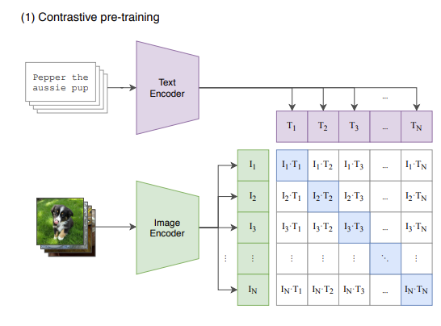
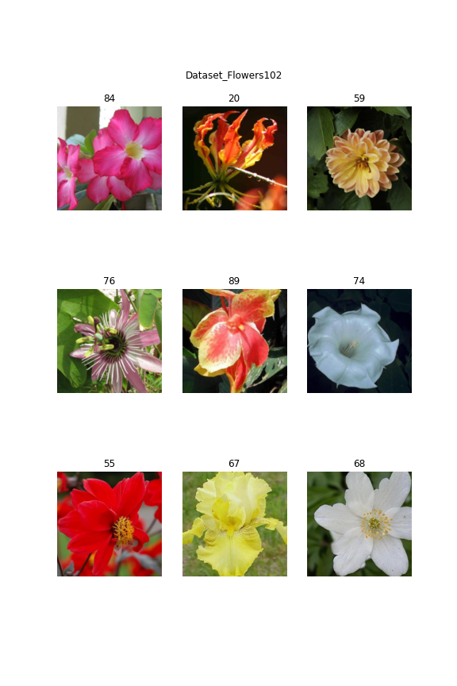
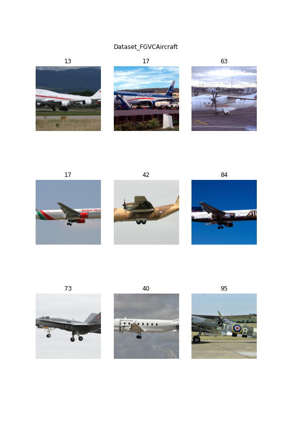
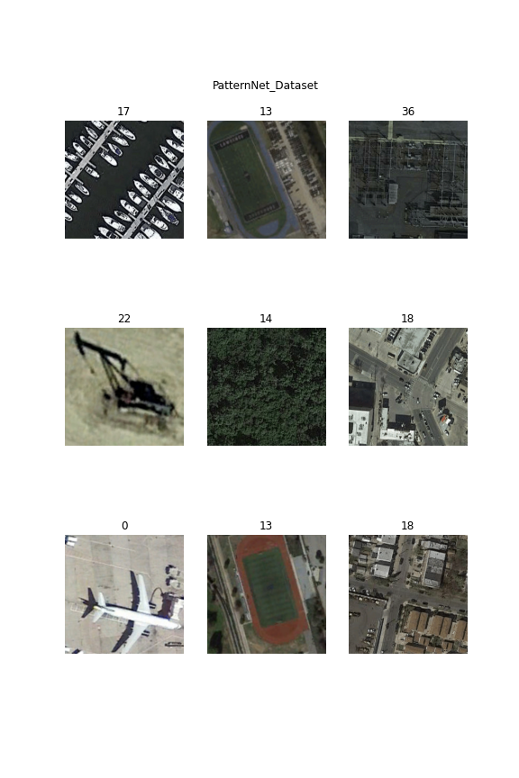
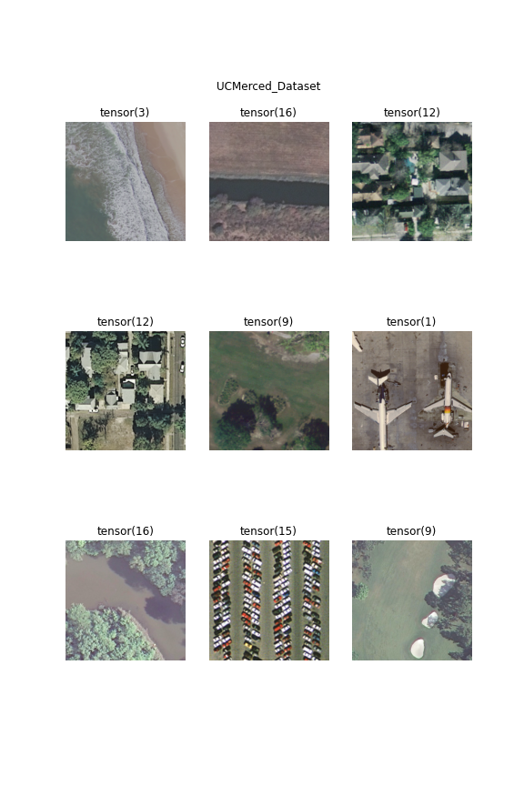
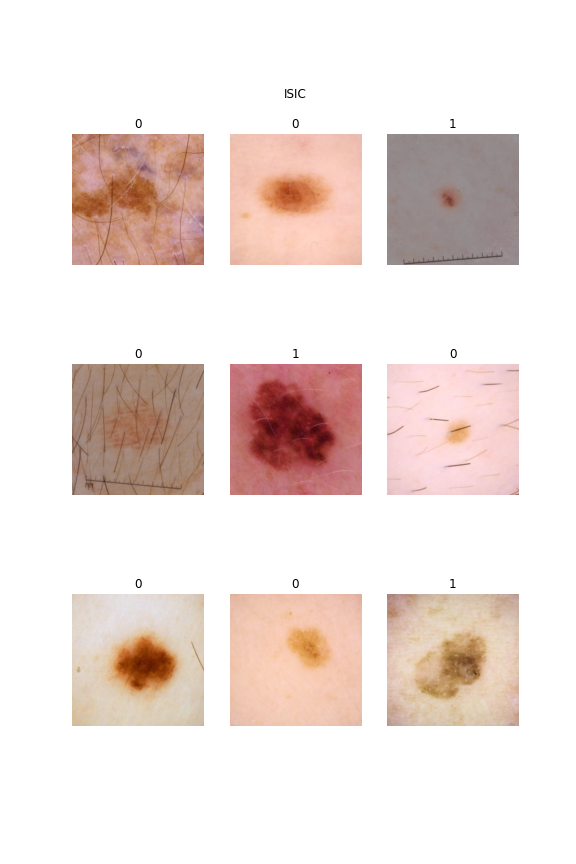
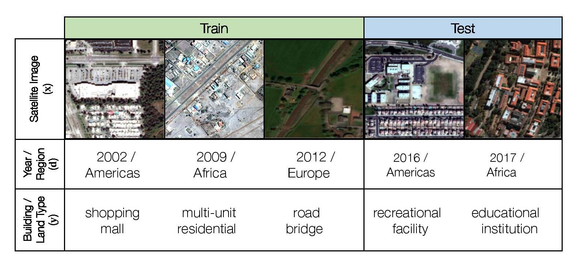

> Explore wider usage of CLIP, a large scale self-supervised models. We believe CLIP have more usage than what's shown in the original paper, as it has great feature extraction ability.

<!--more-->
{: class="table-of-content"}
* TOC
{:toc}

# Motivition 

Imagine you are a machine learning engineer. One day, you want to add some new features for a classification task. For example you may need to do some fine grained classification on chopsticks like identify whether it is a Sushi chopstick, disposable chopstick or hot pot chopstick, but you do have any data. Then, one simple way to solve this problem is to do some data collection on your own, because your boss think find some new people to label it is too complex and time consuming. So, you followed the advice of your boss and then collect some chopstick data and train it. But things can happen over and over again, maybe today is chopsticks, tomorrow is soups and then your inference pipeline become more and more difficult to maintain. 

But could we just maintain some easily accessible data like image with language supervision and then train a model like clip instead of maintain lots of specialized model and data? For example, CLIP representation is very powerful and able to outperform many existing model with only CLIP image feature and linear classifier. Could we just maintain CLIP model and its training data and do simple ML classification instead of train deep model each time? 

# What we hope to demonstrate
Recently, there is a trend in industry to train large-scale self-supervised models. Such models utilize huge amount of unlabeled data to learn the intrinsic features, and in this way get more general and robust prediction result. CLIP is such a model consisting of an image encoder and a text encoder. In the forward stage, it calculates the loss based on the difference between the image/text feature vector pair with an image/text-description pair as input, and optimizes the two encoders' parameters simultaneously. Typical usage of the CLIP model includes using the image encoder as pretrained model to finetune, and formulizing the prediction task as text queries, together with the image feeding into CLIP to get a score vector. 

We believe CLIP have more usage than what's shown in the original paper, as it has great feature extraction ability.

First we'll compare CLIP with other models trained with general labeled dataset. We want to see if finetuning CLIP as pretrained model results in higher accuracy, fewer labeled data for a specific task.

Second, we'll use CLIP image encoder to extract feature vectors for a specific task/dataset, and unsupervised-learn to cluster the vectors. We'll examinate whether the cluster reflects the actual data label. If so, such clustering method can be used for auto-labeling and label imbalance elimination. 

Third, we'll also further explore the generality of CLIP. Whether its good features is sensitive to the specific data domain (whether similar data exists in original unlabeled training data or not)

# Related work 

## Tested model: 

The experiment is run on the following model, there are 3 type of model

Type 1: language supervised model
- CLIP model( VIT-32 ) [1]

Type 2: model trained on open scource dataset (ImageNet)
- Vision Transformer: VIT-32 (base and large version), VIT-16 (base and large version) [2]
- New CNN: convnext_small, convnext_base [3]
- Traditional CNN: efficientnet_b4,efficientnet_b6 [4]

Type 3: Model with self-supervised pretraining
- Beit [5]
- ViTMAE [6]
- DINO [7]
- Data2vec [8]

## Summary of tested model

|    | model               |   year | Key technology                                    | Fine tune on imagenet                     | Good for representation learning    | pretrain dataset                           | dataset reference                                                                                                                                                                                                                                                                                 |
|---:|:--------------------|-------:|:--------------------------------------------------|:------------------------------------------|:------------------------------------|:-------------------------------------------|:--------------------------------------------------------------------------------------------------------------------------------------------------------------------------------------------------------------------------------------------------------------------------------------------------|
|  0 | CLIP                |   2021 | Contrastive learning, vision-language supervision |                                           | Y                                   | 400 million (image,text) pairs from openai |                                                                                                                                                                                                                                                                                                   |
|  1 | Data2vec            |   2022 | teacher-student Mask                              | 86.6 (L) 84.2(B)                          |                                     | ImageNet 1k                                | Jia Deng, Wei Dong, Richard Socher, Li-Jia Li, Kai Li, and Li Fei-Fei. ImageNet: A large-scale hierarchical image database. In CVPR, 2009.                                                                                                                                                        |
|  2 | DINO                |   2021 | teacher student                                   | 82.8 (B)                                  | Y                                   | ImageNet                                   | Olga Russakovsky, Jia Deng, Hao Su, Jonathan Krause, Sanjeev Satheesh, Sean Ma, Zhiheng Huang, Andrej Karpathy, Aditya Khosla, Michael Bernstein, Alexander C Berg, and Li Fei-Fei. Imagenet large scale visual recognition challenge. IJCV, 2015.                                                |
|  3 | Beit                |   2021 | dVAE mask                                         | 83.4 (B) 86.3(L)                          |                                     | training set of ImageNet 1k (1.2 M)        | Jia Deng, Wei Dong, Richard Socher, Li-Jia Li, Kai Li, and Li Fei-Fei. ImageNet: A large-scale hierarchical image database. In CVPR, 2009.                                                                                                                                                        |
|  4 | MAE                 |   2021 | Mask                                              | 83.6 (B) 85.9 (L)                         |                                     | ImageNet-1K                                | Jia Deng, Wei Dong, Richard Socher, Li-Jia Li, Kai Li, and Li Fei-Fei. ImageNet: A large-scale hierarchical image database. In CVPR, 2009.                                                                                                                                                        |
|  5 | vit_b_16 & vit_b_32 |   2021 | VIT, pretrain                                     | 84.15 (16 B JFT300M) 80.73 (32 B JFT300M) |                                     | JFT300M                                    | Alexey Dosovitskiy, Lucas Beyer, Alexander Kolesnikov, Dirk Weissenborn, Xiaohua Zhai, Thomas Unterthiner, Mostafa Dehghani, Matthias Minderer, Georg Heigold, Sylvain Gelly, et al. An image is worth 16x16 words: Transformers for image recognition at scale. preprint arXiv:2010.11929, 2020. |
|  6 | convnext            |   2022 | CNN modification                                  | 85.1 (B) 85.5 (L)                         |                                     | ImageNet-22K.                              |                                                                                                                                                                                                                                                                                                   |
|  7 | EfficientNet        |   2020 | NAS                                               | 80.1 (B6) 84.0 (B6)                       |                                     |                                            |                                                                                                                                                                                                                                                                                                   |

## Dataset for general classification

There are two type of dataset we will test:

Dataset similar to CLIP pretraining data
- Flowers102: 102 category dataset, consisting of 102 flower categories. The flowers chosen to be flower commonly occuring in the United Kingdom. Some examples are shown below. 

- FGVCAircraft: The dataset contains 10,200 images of aircraft, with 100 images for each of 102 different aircraft model variants, most of which are airplanes. 

Dataset different from CLIP pretraining data
- PatternNet(torch geo): Dataset from torchgeo package [9] The PatternNet dataset is a dataset for remote sensing scene classification and image retrieval. It have 38 scene classes, 800 images per class. 

- UCMerced(torch geo): Dataset from torchgeo package [9]. The UC Merced dataset is a land use classification dataset of 2.1k 256x256 1ft resolution RGB images of urban locations around the U.S. extracted from the USGS National Map Urban Area Imagery collection with 21 land use classes (100 images per class).

- ISIC [10]: Data from SIIM-ISIC Melanoma Classification 2020. This competition aim to predicting a binary target for each image, 0 denotes benign, and 1 indicates malignant.

## Dataset for data drift

<!-- - rxrx1dataset (wilds) -->
- iwildcamdataset (wilds): Dataset from wilds [11] for animal classification. The input x is a photo from a camera trap, the label y is one of 182 animal species, and the domain d specifies the identity of the camera trap. The training, validation and in-distribution data contain the images from different camera, but out-of-distribution test data are not capture by the camera used in in-distribution camera.

- fmowdataset (wilds): Dataset from wilds [11] for satellite image classification. As satellite data constantly changes due to human activity and environmental processes, these models must be robust to distribution shifts over time. The input x is an RGB satellite image, the label y is one of 62 building or land use. The in-distribution data comprises data from before 2013, while the out-of-distribution test set comprises data from 2016 and after.

# Experiment: 

### Classification experiment on general dataset

The experiment is to test the performance of different models on the general dataset mentioned before. In this part, two types of experiment are conducted:

Classification with feature and simple ML algorithm:
 - This experiment aim to test the respresentation performance of each model. For each dataset, extract feature from last layer of the network and perform KNN and logistic regression. 

Fine tuning on each dataset:
 - This aim to test each model performance after fine-tuning. For each dataset, fine tune each network on each dataset.

The evaluation metric for this experiment is accuracy. In this case, we want to test the performance of each model on each general dataset with respect to different amount of training and validation data. The amount of training and validation data increased in order of 10 from 10 samples per class to 1000 samples per class. But for general dataset, not all dataset have enough data. Thus, we detailed designed the training, validation and testing split for dataset in following table. The number listed in (10)train:val:test, (100)train:val:test and (1000)train:val:test means the number of data used in training, validation and testing dataset. 

|    | dataset              |   total data |   Number of labels | (10)train:val:test   | (100)train:val:test   | (1000)train:val:test   |
|---:|:---------------------|-------------:|-------------------:|:---------------------|:----------------------|:-----------------------|
|  0 | ISIC                 |         1150 |                  2 | 14:4:1132            | 148:50:952            | 688:230:232            |
|  1 | PatternNet_Dataset   |        30400 |                 38 | 266:76:30058         | 2812:950:26638        | 18202:6080:6118        |
|  2 | UCMerced_Dataset     |         1260 |                 21 | 147:42:1071          | 567:189:504           | 567:189:504            |
|  3 | Dataset_FGVCAircraft |         3334 |                100 | 700:200:2434         | 1900:600:834          | 1900:600:834           |
|  4 | Dataset_DTD          |         1880 |                 47 | 329:94:1457          | 1081:376:423          | 1081:376:423           |
|  5 | Dataset_Flowers102   |         1020 |                102 | 510:204:306          | 510:204:306           | 510:204:306            |

From the table, Dataset_Flowers102 only have one type of split way. UCMerced_Dataset, Dataset_FGVCAircraft and Dataset_DTD have two type of split way. This is because these dataset have not enought data for each label (e.g. Dataset_Flowers102 on have 10 data for each label, Dataset_DTD have 40 samples per label). Thus, in this experiment, we just repeat the the last experiment for Dataset_Flowers102, UCMerced_Dataset, Dataset_FGVCAircraft and Dataset_DTD for those experiment that do not have enough labels.

### Classification experiment on Data Drift dataset

Same as before, the experiment is to test the performance of different models on the data drift dataset. In this case, the model is trained on the in-distribution data and tested on both in-distribution and out-of-distribution data. 

Classification with feature and simple ML algorithm:
 - This experiment aim to compare the model representation performance in terms of data drift. For each dataset, extract feature from last layer of the network and perform KNN and logistic regression. 

Fine tuning on each dataset:
 - This aim to test the model sensitivity in terms of fine tuning for data drift. For each dataset, fine tune each network on each dataset.

The evaluation metric for this experiment is still accuracy on in-distribution test set and out-of-distribution test set. Same as previous experiment, we split training data in order of 10 that start from 10 samples and more detailed split is listed below. 

|    | dataset         |   total training data |   total val data |   total id test data |   total ood test data |   Number of labels | (10)train:val   | (100)train:val   | (1000)train:val   |
|---:|:----------------|----------------------:|-----------------:|---------------------:|----------------------:|-------------------:|:----------------|:-----------------|:------------------|
|  0 | FMoWDataset     |                 76863 |            19915 |                11327 |                 22108 |                 62 | 434:124         | 4517:1527        | 40150:12721       |
|  1 | IWildCamDataset |                129809 |            14961 |                 8154 |                 42791 |                 87 | 1090:149        | 6694:1394        | 33628:7079        |

### Clustering experiment 

In clustering experiment, we firstly extract feature from each model. The feature extraction method is same as the one used in logistic regression and KNN experiment. To have better clustering performance, we firstly do dimension reduction with UMAP with euclidean metric. Then, we use k-means clustering to cluster the data. In this case, we perform clustering on all dataset in general dataset and test data in data drift dataset. The evaluation metric for this experiment is adjusted rand score, which can be considered as accurcy measure in clustering task.

### Training and preprocessing

The training pipeline is built based on pytorch and pytorch-lightning. Each training samples are cropped and normalized to the 244x244 with mean=[0.485, 0.456, 0.406] and std=[0.229, 0.224, 0.225].

The GPU used for fine tuning is NVIDIA GeForce RTX 3070 laptop GPU. The batch size for training is 16 and optimizer is Adam. The learning rate is 1e-5. The number of epochs depend on early stopping. The early stopping is used to stop training when the validation loss does not decrease for 30 epoch.

# Results

### Result for classification experiment on general dataset

### Result for classification experiment on Data Drift dataset

### Result for Clustering experiment 

The result of clustering experiment is shown below. For each column, each model is arranged in the order of model performance and the number in right of model name is adjusted rand score.

|    | Dataset_DTD         | Dataset_FGVCAircraft   | Dataset_Flowers102   | ISIC                | FMoWDataset ID      | FMoWDataset OOD     | IWildCamDataset ID   | IWildCamDataset OOD   | PatternNet_Dataset   | UCMerced_Dataset    |
|---:|:--------------------|:-----------------------|:---------------------|:--------------------|:--------------------|:--------------------|:---------------------|:----------------------|:---------------------|:--------------------|
|  0 | CLIP 0.364          | CLIP 0.147             | CLIP 0.654           | data2vec 0.177      | CLIP 0.086          | CLIP 0.102          | DINO 0.213           | vit_b_32 0.182        | vit_b_32 0.846       | CLIP 0.684          |
|  1 | DINO 0.343          | DINO 0.106             | DINO 0.623           | Beit 0.164          | DINO 0.084          | DINO 0.079          | vit_b_32 0.173       | DINO 0.165            | convnext_base 0.841  | vit_b_16 0.649      |
|  2 | convnext_tiny 0.303 | vit_b_16 0.072         | convnext_tiny 0.380  | ViTMAE 0.120        | vit_b_32 0.055      | convnext_tiny 0.057 | CLIP 0.166           | vit_b_16 0.148        | convnext_tiny 0.834  | DINO 0.645          |
|  3 | convnext_base 0.291 | vit_b_32 0.062         | vit_b_16 0.363       | CLIP 0.087          | vit_b_16 0.049      | vit_b_16 0.057      | vit_b_16 0.161       | convnext_tiny 0.127   | vit_b_16 0.824       | vit_b_32 0.616      |
|  4 | vit_b_16 0.284      | convnext_tiny 0.046    | vit_b_32 0.344       | vit_b_32 0.029      | convnext_tiny 0.047 | vit_b_32 0.052      | convnext_tiny 0.155  | CLIP 0.126            | DINO 0.796           | convnext_tiny 0.538 |
|  5 | vit_b_32 0.275      | convnext_base 0.031    | convnext_base 0.257  | vit_b_16 0.020      | convnext_base 0.038 | convnext_base 0.048 | convnext_base 0.135  | convnext_base 0.097   | CLIP 0.744           | convnext_base 0.508 |
|  6 | ViTMAE 0.030        | ViTMAE 0.006           | Beit 0.058           | DINO 0.020          | Beit 0.009          | Beit 0.009          | Beit 0.117           | Beit 0.089            | ViTMAE 0.394         | Beit 0.172          |
|  7 | Beit 0.022          | Beit 0.006             | ViTMAE 0.053         | convnext_base 0.002 | ViTMAE 0.004        | ViTMAE 0.005        | data2vec 0.072       | data2vec 0.058        | Beit 0.365           | ViTMAE 0.148        |
|  8 | data2vec 0.013      | data2vec 0.005         | data2vec 0.047       | convnext_tiny -0.00 | data2vec 0.004      | data2vec 0.004      | ViTMAE 0.058         | ViTMAE 0.040          | data2vec 0.085       | data2vec 0.064      |

<!-- ### Evaluation

Classification task:
 - Accuracy: Percentage of correction prediction

Clustering task: 
 - homogeneity score: each cluster contains only members of a single class.
 - completeness score: all members of a given class are assigned to the same cluster.
 - v measure score: (2 * homogeneity * completeness)/(homogeneity + completeness)
 - adjusted rand score: Rand index adjusted for chance. The Rand Index computes a similarity measure between two clusterings by considering all pairs of samples and counting pairs that are assigned in the same or different clusters in the predicted and true clusterings. -->

<!-- 
## Project Timeline
- ~~Week 1-2: Define problems and writing proposal.~~
- ~~Week 3: Do presentation and test feasibility of different kind of models.~~
- Week 4-6: Write training pipeline and clustering pipeline for different models
  - In week 5, we should have a runable pipeline for training and testing
  - In week 6, we should have some result for classification and clustering tasks.
- Week 7-8: Wait for training and test result and focus on further testing on label noise or distribution shift.
- Week 9-10: Start writing report and prepare for presentation. -->

## Reference

[1] Radford, Alec, et al. "Learning Transferable Visual Models From Natural Language Supervision" *arXiv*. 2021.

[2] Alexey, Lucas, et al. "An Image is Worth 16x16 Words: Transformers for Image Recognition at Scale" 

[3] Zhuang, Hanzi Mao1 et al. "A ConvNet for the 2020s"

[4] Mingxing, Quoc "EfficientNet: Rethinking Model Scaling for Convolutional Neural Networks"

[5] Hangbo, Li, Furu "BEiT: BERT Pre-Training of Image Transformers"

[6] Kaiming, Xinlei et al "Masked Autoencoders Are Scalable Vision Learners"

[7] Mathilde, Hugo et al "Emerging Properties in Self-Supervised Vision Transformers"

[8] Alexei, Wei-Ning et al  "data2vec: A General Framework for Self-supervised Learning in Speech, Vision and Language"

[9] Adam J., Caleb et al "TorchGeo: deep learning with geospatial data" https://arxiv.org/abs/2111.08872

[10] SIIM-ISIC Melanoma Classification https://www.kaggle.com/competitions/siim-isic-melanoma-classification/overview/siim-ai-conference

[11] WILDS: A Benchmark of in-the-Wild Distribution Shifts. Pang Wei Koh*, Shiori Sagawa*, Henrik Marklund, Sang Michael Xie, Marvin Zhang, Akshay Balsubramani, Weihua Hu, Michihiro Yasunaga, Richard Lanas Phillips, Irena Gao, Tony Lee, Etienne David, Ian Stavness, Wei Guo, Berton A. Earnshaw, Imran S. Haque, Sara Beery, Jure Leskovec, Anshul Kundaje, Emma Pierson, Sergey Levine, Chelsea Finn, and Percy Liang. ICML 2021.

## Appendix
